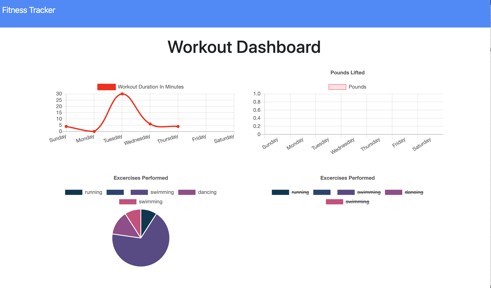

# Workout-Tracker-App
## Description
* This app is a workout app that allows the user to create and track thier dialy workouts.  When the user visits the main page they will be given an an option to create a new workout or continue with thier last workout.  The user will ultimately be able to add exercises to past workouts and/or add new exercises.

## Technology
* This app used Mongoose, Robo3T, JavaScript, Heroku for deployment as well as GitHub. 
* As a developer I had the opportunity to use HTTP routes such as GET, POST, and Put while pushig data.

## Deployment 
* https://peaceful-basin-13128.herokuapp.com/ - Heroku Deployment
* https://github.com/MoCivers-Davis/Workout-Tracker-App - GitHub Repo
* https://mocivers-davis.github.io/Workout-Tracker-App/ - UI Deployed

